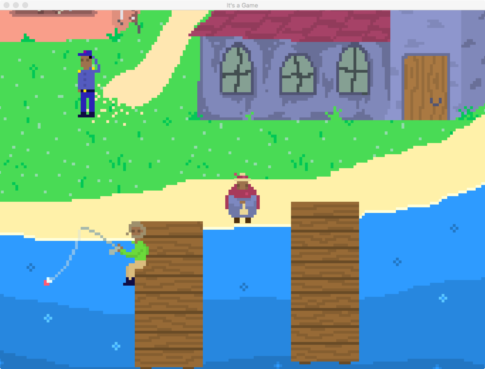

# RPG Engine
A game engine built in C++ that uses SFML (Simple Fast Multimedia Library).  The engine is for a turn-based role playing game that I am making in my spare time for fun.  Currently the game consists of an over-world where users walk around and talk to non-player characters and a battle system using turn-based combat.  Here are a few pictures of what it looks like right now.

The Title Screen-

A shot of the  bustling town center-

Staring out over the sea-

And here's what the dialogue system looks like-

## About the Project
This is I project I started in 2015 in order to teach myself C++ and general program architecture by developing real code for something that I would be motivated to work on.  I have restructured the project several times after learning more about proper programming patterns, but the engine currently runs on a state-based system.  But what exactly does that mean?

Each state represents a mode of the game, and by default contains all the necessary game information that every game mode is going to need, like the clock, the window, the player party, the current map, etc.

The game starts by creating an overworld mode game-state, which let's you walk around and talk to people, or fight random enemies.  If you get into a fight then a battle mode game-state is added to the state stack, and the game starts executing that instead (since it's on the top of the stack).  Once that fight is resolved, the battle mode game-state is popped off the stack and the control of the game returns to the overworld state.

Each state shares the same base class so that they can inherit common functionality so that the game doesn't need to worry about what state it's in, it just needs to let whatever state is on top do its thing.  Specifically, every state implements it's own versions of the update(), draw(), and handleEvent() methods so that it can function as it's own state.

## Installation
While it's possible to look through all the code that I've written, it's not currently possible to download and play anything.  I have purposefully not included any of the art assets that I have created for this game, so that the entire game cannot be stolen if I someday decide to monetize it.  However, at some point in the future I'll set up an itch.io link where you can play whatever tech demo I have available.

## TO DO
* Game save capabilities
* Game loading capabilities
* Integrate an audio system
* Create non-placeholder art

## License
The MIT License (MIT)

Copyright (c) 2017 - Noah Kittleson

Permission is hereby granted, free of charge, to any person obtaining a copy of this software and associated documentation files (the "Software"), to deal in the Software without restriction, including without limitation the rights to use, copy, modify, merge, publish, distribute, sublicense, and/or sell copies of the Software, and to permit persons to whom the Software is furnished to do so, subject to the following conditions:

The above copyright notice and this permission notice shall be included in all copies or substantial portions of the Software.

THE SOFTWARE IS PROVIDED "AS IS", WITHOUT WARRANTY OF ANY KIND, EXPRESS OR IMPLIED, INCLUDING BUT NOT LIMITED TO THE WARRANTIES OF MERCHANTABILITY, FITNESS FOR A PARTICULAR PURPOSE AND NONINFRINGEMENT. IN NO EVENT SHALL THE AUTHORS OR COPYRIGHT HOLDERS BE LIABLE FOR ANY CLAIM, DAMAGES OR OTHER LIABILITY, WHETHER IN AN ACTION OF CONTRACT, TORT OR OTHERWISE, ARISING FROM, OUT OF OR IN CONNECTION WITH THE SOFTWARE OR THE USE OR OTHER DEALINGS IN THE SOFTWARE.
